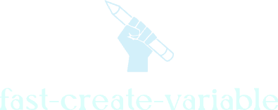

 English | <a href="./README_zh.md">简体中文</a>

>WIP: Select the variable name to quickly provide the creation type, such as ref, computed, methods, function, etc., and generate the corresponding position according to whether it is currently vue2 or vue3.

## :coffee:

[buy me a cup of coffee](https://github.com/Simon-He95/sponsor)

## License

[MIT](./license)
